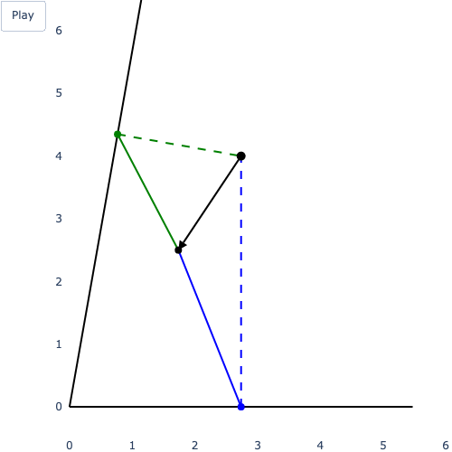
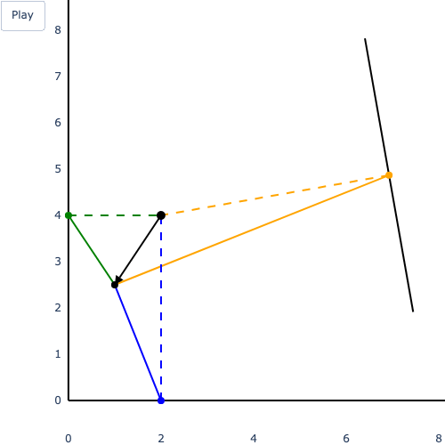
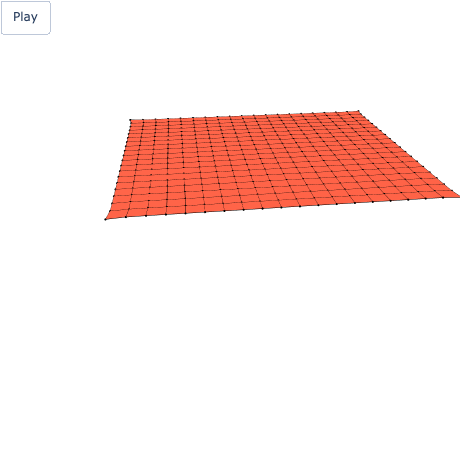
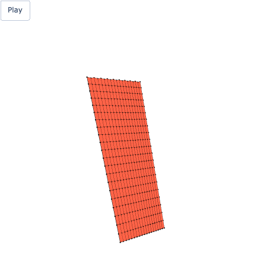

# HW 1
**Tasks 1 and 2**

  
  

# HW 2 (Verlet integration)
**Tasks 1-3**

  
  
  

**Cloth sim 2D & 3D**

  
  

**Soft ball sim 2D & 3D**

  
  

# HW 3 (XPBD)
**Cloth in a non-convex bounding mesh in 3D**

  

**Cloth vs rigid body**

  
  
  

